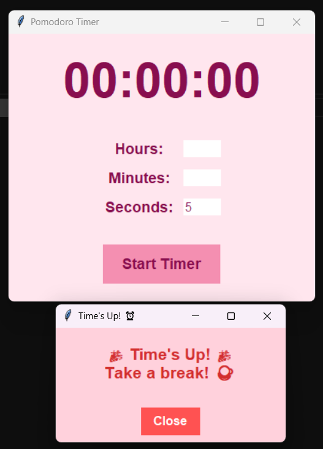

## Pomodoro Timer 🍅⏰

A simple and colorful Pomodoro Timer built with Python and Tkinter. This timer helps you stay productive by breaking your work into intervals with breaks in between.


## Features ✨
- **Customizable Timer**: Set hours, minutes, and seconds.
- **Soothing Tune**: Plays a relaxing sound when the timer ends.
- **Colorful Popup**: A creative and colorful popup message with emojis.
- **Pink Theme**: A visually appealing pink-themed user interface.





## How to Run 🚀
1. Clone the Repository:
   ```bash
   git clone https://github.com/Sremoyee/Pomodoro-Timer.git
   cd Pomodoro-Timer